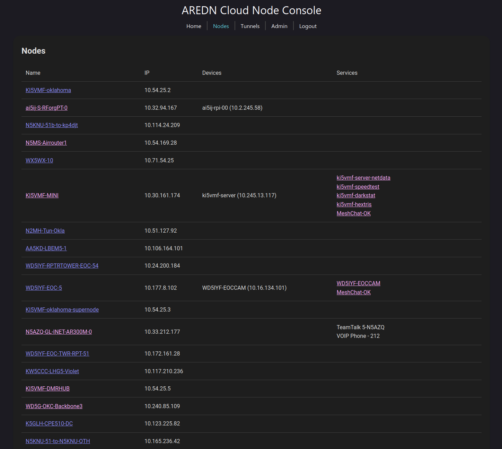
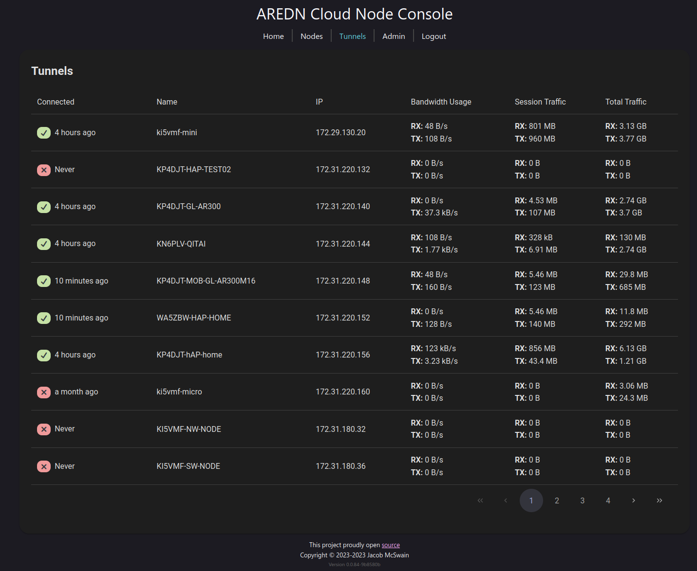
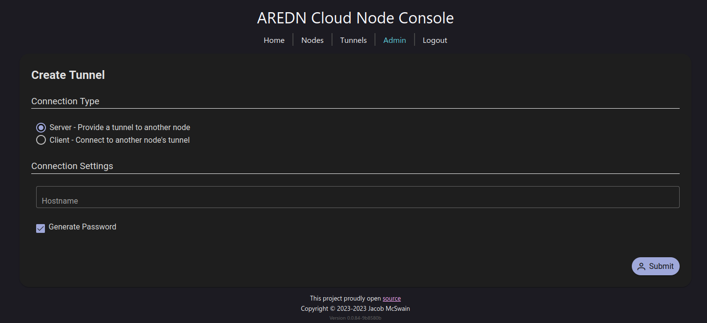
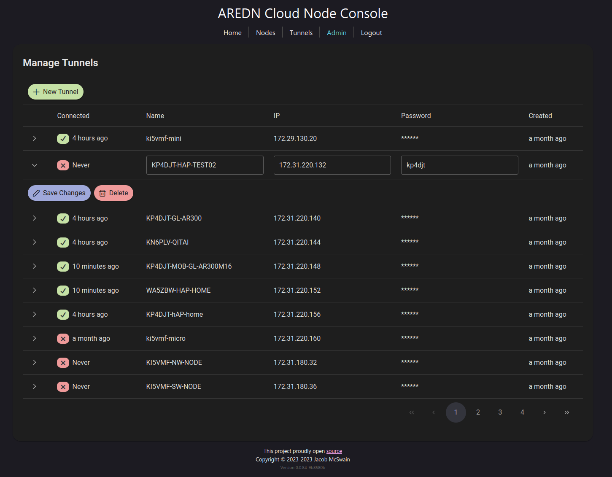

# AREDN Virtual Node

This project is intended to set up a "Cloud Tunnel" as an alternative implementation for the AREDN network. It acts like a node without any RF link capabilities. The purpose is to allow a large group of users to connect to a tunnel prior to RF deployments being rolled out. It uses [aredn-base](https://github.com/USA-RedDragon/dockers/pkgs/container/aredn-base) as it's base image and runs the [aredn-manger](https://github.com/USA-RedDragon/aredn-manager/) service.

## Warning

It should be noted that in a disaster situation, it's likely that the internet will go out and this tunnel will be of no use.

## Quick links

- [FAQs](https://github.com/USA-RedDragon/aredn-cloud-tunnel/wiki/FAQ)
- [Environment Variables](https://github.com/USA-RedDragon/aredn-cloud-tunnel/wiki/Environment-Variables)
- [Deployment Guide](https://github.com/USA-RedDragon/aredn-cloud-tunnel/wiki/Deployment-Guide)
- [Admin's Guide](https://github.com/USA-RedDragon/aredn-cloud-tunnel/wiki/Admin's-Guide)
- [User's Guide](https://github.com/USA-RedDragon/aredn-cloud-tunnel/wiki/User's-Guide)

## Screenshots

  
More? Click to expand

